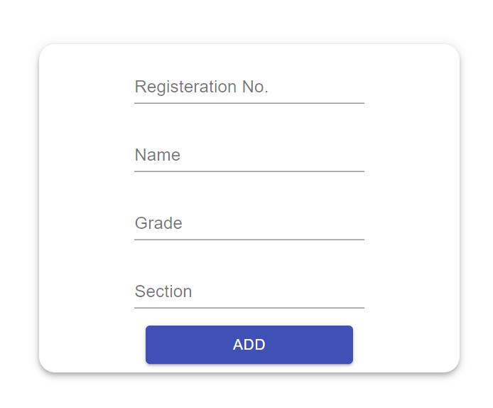
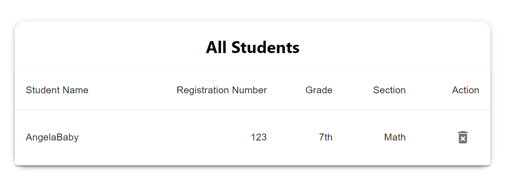

# ReadMe
This is a little project as a school management system.

## Table of Contents
- [Background](#background)
    - [Functional Requirement](#Functional-Requirement)
    - [Tech Stack](#Tech-Stack)
- [Install](#install)
- [Usage](#usage)
    - [Staff Interface](#Staff-Interface)

## Background
### Functional Requirement
1. [**The staff interface**](#Staff-Interface), is now focused on adding and deleting the students' information(their name, registration number, grade, section) to the database, not requiring login function and any data validation.
### Tech Stack
1. The Database is created with **MongoDB**, and I use the service of **MongoDB Atlas** since it's free.
2. The front-end is created with **React** and **Material-UI**.
3. The back-end is created with **Node.js** and **Express**.

## Install
This application is basically a MERN project.

1. Clone the repository. 
2. Build your MongoDB database on Atlas or anywhere you prefer, then fill in the ***connect.js*** which is under the folder of ***server***.
*I removed my connect.js due to the protection of my sensitive data, but you can fill in yours to connect to the database.*
3. Open two terminals, one `cd client`, another `cd server`. 
4. Run `npm install package.json` separately in these two terminals.
5. Then run `npm start` separately in these two terminals.
5. Now, you can enter the system through http://localhost:3000/.

## Usage
### Staff Interface
**Route:**
"http://localhost:3000/"

**Function:**
- [add](#add)
- [delete](#delete)
- [display all](#display-all)
    
#### Add
This function is to add records to the database. There are no restrictions or validation.
 

#### Delete
This function is to delete. Only need to click the icon of bin.
 

#### Display All
This function is to display all the records in database.
 
